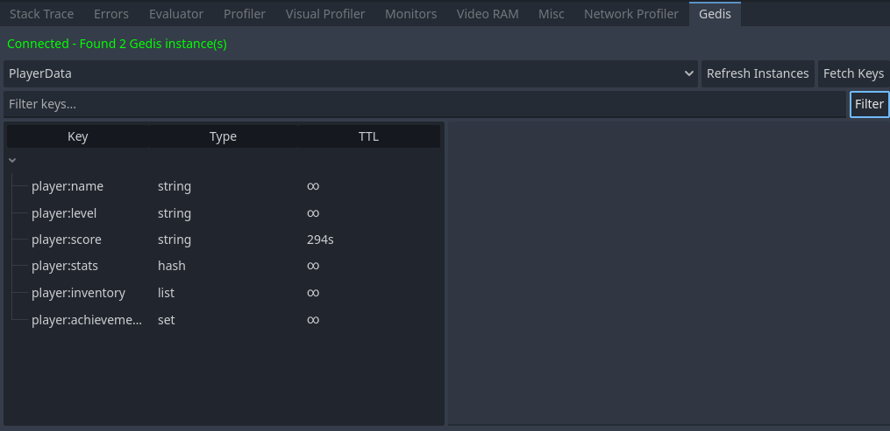

# Gedis

<p align="center">
    
</p>

<p align="center">
    An in-memory, Redis-like datastore for Godot.
</p>

[](https://discord.gg/Rx9CZX4sjG) [](https://mastodon.gamedev.place/@krazyjakee) [](https://www.youtube.com/@GodotNodot)


## Overview

Gedis is a high-performance, in-memory key-value datastore for Godot projects, inspired by Redis. It provides a rich set of data structures and commands. Simply create an instance with `var gedis = Gedis.new()` and start using it: `gedis.set_value("score", 10)`.


**Redis-like? What the heck is Redis?** - See [Redis in 100 Seconds](https://www.youtube.com/watch?v=G1rOthIU-uo).

## Features

- **Strings**: Basic key-value storage (`set_value`, `get_value`, `incr`, `decr`).
- **Hashes**: Store object-like structures with fields and values (`hset`, `hget`, `hgetall`).
- **Lists**: Ordered collections of strings, useful for queues and stacks (`lpush`, `rpush`, `lpop`).
- **Sets**: Unordered collections of unique strings (`sadd`, `srem`, `smembers`).
- **Key Expiry**: Set a time-to-live (TTL) on keys for automatic deletion (`expire`, `ttl`).
- **Pub/Sub**: A powerful publish-subscribe system for real-time messaging between different parts of your game (`publish`, `subscribe`).

## Installation

1.  Copy the entire `addons/Gedis` folder into your Godot project's `addons` directory.
2.  In Godot, go to **Project -> Project Settings -> Plugins** and enable the "Gedis" plugin.
3.  The plugin will register an autoloaded singleton named `Gedis`, which is now available globally in your scripts.

## Usage Examples

First, create an instance of Gedis in your script:

```gdscript
# Create a Gedis instance
var gedis = Gedis.new()
```

### Strings

```gdscript
# Set and get a value
gedis.set_value("player_name", "Alice")
var name = gedis.get_value("player_name") # "Alice"

# Increment/decrement a numeric value
gedis.set_value("score", 100)
gedis.incr("score") # 101
gedis.decr("score") # 99
```

### Hashes

```gdscript
# Store player data in a hash
gedis.hset("player:1", "name", "Bob")
gedis.hset("player:1", "hp", 100)
gedis.hset("player:1", "mana", 50)

# Get a single field
var player_name = gedis.hget("player:1", "name") # "Bob"

# Get all fields as a Dictionary
var player_data = gedis.hgetall("player:1") # {"name": "Bob", "hp": 100, "mana": 50}
```

### Lists

```gdscript
# Use a list as a queue for game events
gedis.rpush("events", "player_spawned")
gedis.rpush("events", "enemy_appeared")

# Process the first event in the queue
var event = gedis.lpop("events") # "player_spawned"
var queue_length = gedis.llen("events") # 1
```

### Sets

```gdscript
# Store unique items a player has collected
gedis.sadd("inventory", "sword")
gedis.sadd("inventory", "shield")
gedis.sadd("inventory", "sword") # This will be ignored

# Check if an item exists
var has_shield = gedis.sismember("inventory", "shield") # true

# Get all items
var all_items = gedis.smembers("inventory") # ["sword", "shield"] or ["shield", "sword"]
```

### Key Expiry

```gdscript
# Create a temporary key
gedis.set_value("session_token", "xyz123")
gedis.expire("session_token", 60) # Expires in 60 seconds

# Check the remaining time
var time_left = gedis.ttl("session_token") # e.g., 59

# Make the key permanent again
gedis.persist("session_token")
var time_left_after_persist = gedis.ttl("session_token") # -1 (no expiry)
```

### Pub/Sub System

The Pub/Sub system allows for decoupled communication using signals.

```gdscript
# Subscriber script
var gedis = Gedis.new()

func _ready():
    # Subscribe to the 'game_events' channel and connect to a local method
    gedis.subscribe("game_events", self)
    gedis.connect("pubsub_message", _on_game_event)

func _on_game_event(channel, message):
    print("Received message on channel '%s': %s" % [channel, message])

# Publisher script (can be anywhere else)
var gedis = Gedis.new()

func _on_button_pressed():
    # Publish a message to the 'game_events' channel
    gedis.publish("game_events", "Player pressed the button!")
   ```
   
   ### Pattern-Based Subscriptions
   
   You can also subscribe to channels that match a specific pattern.
   
   ```gdscript
   # PSubscriber script
   var gedis = Gedis.new()
   
   func _ready():
    # Subscribe to all channels starting with 'player:'
    gedis.psubscribe("player:*", self)
    gedis.connect("psub_message", _on_player_event)
   
   func _on_player_event(pattern, channel, message):
    print("Received message on channel '%s' (matched pattern '%s'): %s" % [channel, pattern, message])
   
   # Publisher script
   var gedis = Gedis.new()
   
   func _on_some_event():
    gedis.publish("player:login", "Alice logged in")
    gedis.publish("player:logout", "Bob logged out")
   ```

## Debugger

Gedis comes with a debugger interface!



## API Reference

| Method                           | Description                                                |
| -------------------------------- | ---------------------------------------------------------- |
| **Strings**                      |                                                            |
| `set_value(key, value)`          | Sets the string value of a key.                            |
| `get_value(key)`                 | Gets the string value of a key.                            |
| `del(keys)`                      | Deletes one or more keys (accepts Array).                  |
| `exists(keys)`                   | Checks if keys exist (accepts Array).                      |
| `key_exists(key)`                | Checks if a single key exists.                             |
| `incr(key)`                      | Increments the integer value of a key by one.              |
| `decr(key)`                      | Decrements the integer value of a key by one.              |
| `keys(pattern)`                  | Gets all keys matching a pattern.                          |
| **Hashes**                       |                                                            |
| `hset(key, field, value)`        | Sets the string value of a hash field.                     |
| `hget(key, field, default)`      | Gets the value of a hash field with optional default.      |
| `hgetall(key)`                   | Gets all the fields and values in a hash as a Dictionary.  |
| `hdel(key, fields)`              | Deletes hash fields (accepts single field or Array).       |
| `hexists(key, field)`            | Checks if a hash field exists.                             |
| `hkeys(key)`                     | Gets all the fields in a hash.                             |
| `hvals(key)`                     | Gets all the values in a hash.                             |
| `hlen(key)`                      | Gets the number of fields in a hash.                       |
| **Lists**                        |                                                            |
| `lpush(key, values)`             | Prepends values to a list (accepts single value or Array). |
| `rpush(key, values)`             | Appends values to a list (accepts single value or Array).  |
| `lpop(key)`                      | Removes and gets the first element in a list.              |
| `rpop(key)`                      | Removes and gets the last element in a list.               |
| `llen(key)`                      | Gets the length of a list.                                 |
| `lrange(key, start, stop)`       | Gets a range of elements from a list.                      |
| `lindex(key, index)`             | Gets an element from a list by index.                      |
| `lset(key, index, value)`        | Sets the value of a list element by index.                 |
| `lrem(key, count, value)`        | Removes elements from a list.                              |
| **Sets**                         |                                                            |
| `sadd(key, members)`             | Adds members to a set (accepts single member or Array).    |
| `srem(key, members)`             | Removes members from a set (accepts single member or Array).|
| `smembers(key)`                  | Gets all the members in a set.                             |
| `sismember(key, member)`         | Checks if a member is in a set.                            |
| `scard(key)`                     | Gets the number of members in a set.                       |
| `spop(key)`                      | Removes and returns a random member from a set.            |
| `smove(source, dest, member)`    | Moves a member from one set to another.                    |
| **Expiry**                       |                                                            |
| `expire(key, seconds)`           | Sets a key's time to live in seconds.                      |
| `ttl(key)`                       | Gets the remaining time to live of a key.                  |
| `persist(key)`                   | Removes the expiration from a key.                         |
| **Pub/Sub**                      |                                                            |
| `publish(channel, message)`      | Posts a message to a channel.                              |
| `subscribe(channel, subscriber)` | Subscribes an object to the given channel.                 |
| `unsubscribe(channel, subscriber)` | Unsubscribes an object from the given channel.           |
| `psubscribe(pattern, subscriber)` | Subscribes to channels matching a pattern.                |
| `punsubscribe(pattern, subscriber)` | Unsubscribes from channels matching a pattern.          |

## Contribution Instructions

This addon is implemented in GDScript and does not require native compilation. To work on or test the addon, follow these steps:

1.  **Clone the repository**:

    ```sh
    git clone --recursive https://github.com/NodotProject/Gedis.git
    cd Gedis
    ```

2.  **Develop & Test**:

    - The addon code lives under `addons/Gedis`. Copy that folder into your Godot project's `addons` directory to test changes.
    - Run the project's test suite with `./run_tests.sh`.

3.  **Contribute**:

    Create a branch, make your changes, and open a pull request describing the work.

## License

MIT — see LICENSE for details.
