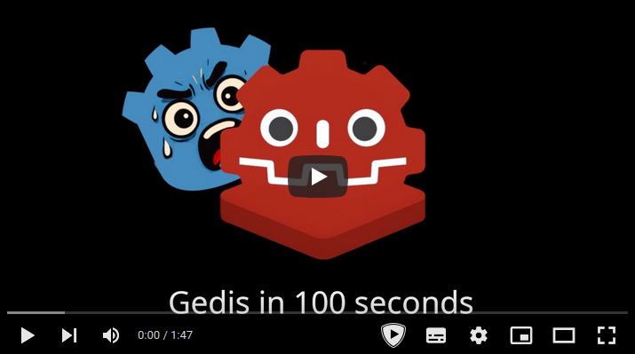

# Gedis

    

    An in-memory, Redis-like datastore for Godot.

  

## Overview

Gedis is a high-performance, in-memory key-value datastore for Godot projects, inspired by Redis. It provides a rich set of data structures and commands. Simply create an instance with `var gedis = Gedis.new()` and start using it: `gedis.set_value("score", 10)`.

**Redis-like? What the heck is Redis?** - See [Redis in 100 Seconds](https://www.youtube.com/watch?v=G1rOthIU-uo).

## Features

- **Strings**: Basic key-value storage (`set_value`, `get_value`, `incr`, `decr`).
- **Hashes**: Store object-like structures with fields and values (`hset`, `hget`, `hgetall`).
- **Lists**: Ordered collections of strings, useful for queues and stacks (`lpush`, `rpush`, `lpop`).
- **Sets**: Unordered collections of unique strings (`sadd`, `srem`, `smembers`).
- **Key Expiry**: Set a time-to-live (TTL) on keys for automatic deletion (`expire`, `ttl`).
- **Pub/Sub**: A powerful publish-subscribe system for real-time messaging between different parts of your game (`publish`, `subscribe`).
- **Sorted Sets**: Ordered collections of unique strings where each member has an associated score (`zadd`, `zrem`, `zrange`).
